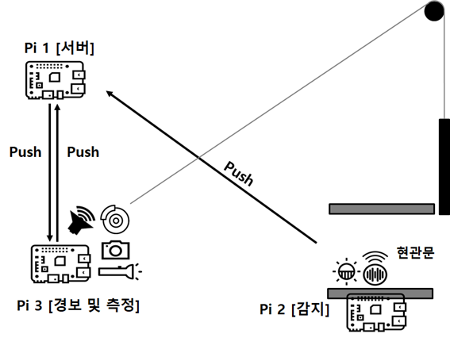
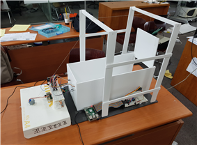
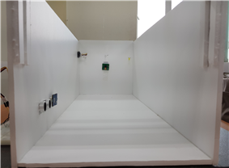

# Intruder-Detection-System
라즈베리 파이에 센서들을 연결하여 침입자를 감지하고 경보를 울리는 시스템

## 1. Project Overview 
+ ### Background 
  * 본래 하고 싶었던 시나리오[미세먼지 측정-환기 알림 시스템]가 있었지만, 앞의 두 개의 센서를 넣자니 시나리오가 맞지 않게 되어서 못하게 되었습니다.
  그 밖에도 초음파 센서까지는 어떻게든 이용할 수 있어도, 조도 센서는 일반적으로 사용되지는 않았습니다. 
  그래서 조도 센서가 이용될만한 주제[=무언가를 수행하는데 있어서, 밝고 어두움이 꼭 판별되어야 되는 어떤 주제]가 무엇이 있을까 고민하다가 
  이 주제를 선정하게 되었습니다. 

+ ### Project Purpose
  * 귀중품 또는 접근제한 구역에 설치하여 침입 시도 및 접근 시도를 탐지할 수 있고, 
  예를 들어 도둑 등의 침입자가 집안에 들어왔다가 나간 후 나중에 이 기록을 확인해봄으로써 누가 침입했는지를 확인할 수 있으며 
  이러한 자료를 증거자료로 활용함으로써 추후 후속조치도 가능한 등의 효과가 있을 것으로 예상됩니다.
  
+ ### Project Goal
  * 기본적으로는 초음파 센서가 항상 탐지를 한다.
  * 무언가 물체가 감지되면, 조도 센서가 작동해서 현재 방의 상태가 밝은지 어두운지를 체크한다.
  * 밝으면 바로 사진을 찍고, 어두우면 LED 등을 켠 이후에 사진을 찍는다.
  * 그와는 별개로 스피커로 경고음이 울리며, 모터가 동작해서 출입문이 닫히게 되는 구조
  
## 2. Development environment
+ ### Server
  * Raspberry Pi 1
  * Rasbian
+ ### Client
  * Raspberry Pi 1
  * Ubuntu 14.04 (Cross Compile)
  
## 3. Language/DB
+ ### Server
  * Python 3
+ ### Client
  * C
  
## 4. Project Architecture & Design
+ ### Architecture
   
+ ### Design
   
   
   
## 5. Function Description
+ ### Pi 1
  * 안전한 곳에서 위치하고, 메인 서버처럼 동작한다
  * 파이2와 파이3을 중개한다.
  * 침입 기록을 관리한다.
  * 파이 간 통신 프로토콜
    - | 수신자 | 송진사 | 전송메세지 | 의미 |
      |:-------------:|:-------------:|:-------------:|:-------------:|
      | Pi 2   [client 1]| Pi 1   [server]| 1111 | detection and now bright |
      |  |  | 1100  | detection and now dark |
      |  |  | 0000  | no detection|
      | Pi 1   [server]| Pi 3   [client 2] | 1111 | detection and now bright |
      |  |  | 1100  | detection and now dark |
+ ### Pi 2
  * 초음파 센서, 조도 센서 연결
  * 적당한 위치에서 초음파 센서를 주기적으로 실행한다.
  * 침입자를 감지하면 빛 센서의 측정값에 따라 결과 메시지를 파이1로 전달한다.
  * 센서의 모듈 코드는 직접 구현
+ ### Pi 3
  * LED, 카메라, 스피커, 모터 연결
  * Pi 1로부터 신호를 받은 값에 따라, LED를 켤 수도 있으며, 카메라를 통해 사진을찍어서 Pi 1로 보낸다. 
  * 센서의 모듈 코드는 직접 구현

## 6. Docs & Video
+ ### Docs
  * [Report](doc/Report.hwp)
+ ### Video
  * [URL1](https://youtu.be/gt3u9KbyXg0)
  * [URL2](https://youtu.be/ENT74C1JVdI)
